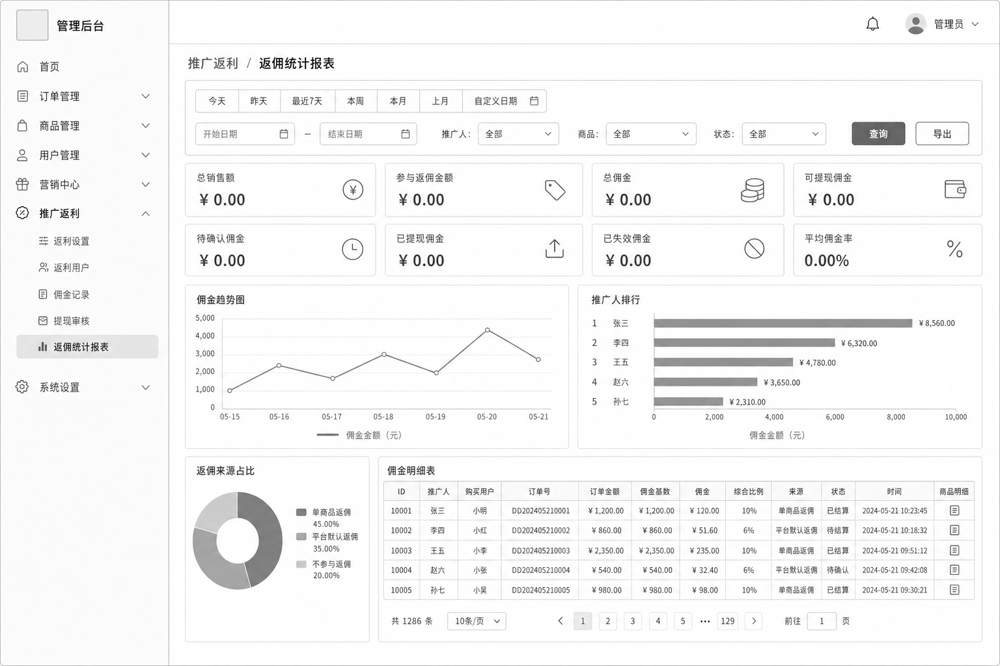
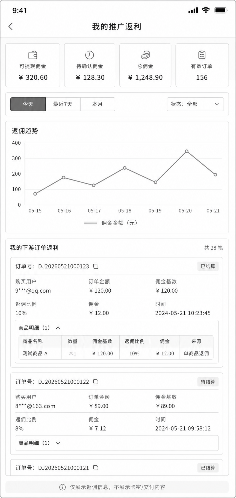

# 推广返利统计报表修改计划

## 目标

在 Admin 后台的“推广返利”菜单下新增总报表页面：

```text
推广返利 / 返佣统计报表
```

同时在用户购买前端的个人中心中，新增一个手机端友好的个人版返佣报表：

```text
个人中心 / 推广返利 / 我的返佣报表
```

Admin 总报表用于集中查看全站推广返利的经营结果、佣金走势、一级代理商排行、返佣来源占比和佣金明细。

用户个人版只用于查看当前登录一级代理商自己的推广返利数据。

本报表以“一级代理准入与购买归属修改计划”为上游规则：

```text
只有使用平台代理邀请码注册成功的新账号才是一级代理商
买家通过一级代理商 aff 注册或登录下单后，永久归属该一级代理商
游客订单只做当次归因，不建立永久归属
```

修改完成后，后台需要支持：

- 按时间周期查看返佣统计。
- 按一级代理商、商品、佣金状态筛选。
- 查看销售额、参与返佣金额、总佣金、可提现佣金、待确认佣金、已提现佣金、已失效佣金。
- 查看点击数、有效订单数、转化率、平均佣金、平均佣金率、代理商客户数、新客订单数、复购订单数。
- 用图表展示佣金趋势、一级代理商排行、返佣来源占比。
- 在佣金明细里看清楚每笔佣金来自单商品返佣、平台默认返佣，还是混合返佣。
- 保持现有返利设置、返利用户、佣金记录、提现审核页面继续可用。

修改完成后，用户个人中心需要支持：

- 当前登录一级代理商查看自己的推广返利数据。
- 当前登录一级代理商查看自己的下游订单返利明细。
- 当前登录一级代理商查看商品级返佣明细、返佣比例、佣金状态。
- 不展示卡密、交付内容、成本价、购买人完整敏感信息。

## 草图

### Admin 总报表草图



### 用户手机端个人版草图



## 菜单位置

在 Admin 左侧菜单中，当前结构为：

```text
推广返利
- 返利设置
- 返利用户
- 佣金记录
- 提现审核
```

新增后改为：

```text
推广返利
- 返利设置
- 代理邀请码
- 返利用户
- 佣金记录
- 返佣统计报表
- 提现审核
```

新增页面路由建议：

```text
/affiliates/reports
```

权限建议：

```text
GET:/admin/affiliates/reports/summary
```

如果后续增加导出接口，再增加：

```text
GET:/admin/affiliates/reports/export
```

## 明确边界

本次新增两类报表页面：

```text
Admin 总报表
用户个人版报表
```

不改变现有返佣计算规则。

本报表不重新定义代理商准入和买家归属规则。

代理商准入、买家永久归属、游客当次归因，以 `affiliate-platform-agent-invite-plan.md` 为准。

本次不修改：

- 商品级返佣计算逻辑。
- 订单支付逻辑。
- 退款和取消订单后的佣金失效逻辑。
- 提现审核逻辑。
- 订单交付逻辑。
- 卡密发放逻辑。

本次页面只读取已有数据进行统计，不重新计算历史订单佣金。

如果历史订单没有生成佣金记录，该报表不主动补佣金。

用户个人版只允许读取当前登录一级代理商自己的推广返利数据，不能传入任意 `affiliate_profile_id` 查看别人数据。

用户个人版还必须确认当前登录用户已经拥有 `affiliate_profiles` 代理档案；普通非代理用户不能看到返佣报表数据。

## 统计口径

### 时间口径

页面筛选项支持：

```text
今天
昨天
最近7天
本周
本月
上月
自定义日期
```

默认建议：

```text
最近7天
```

第一版建议统一按订单支付时间统计：

```text
orders.paid_at
```

原因：

- 报表关注“这个周期下游订单带来了多少返利”。
- 不参与返佣商品不会生成佣金记录，但仍然需要计入“不参与返佣销售额”。
- 使用订单支付时间，可以把有佣金订单和无佣金但带推广归因的订单放在同一个周期里统计。

如果未来要按佣金创建时间统计，可以新增一个筛选项：

```text
统计口径：订单支付时间 / 佣金创建时间
```

第一版先不做这个切换。

### 总销售额

统计周期内，带推广归因快照的已支付订单实付金额合计。

建议字段：

```text
orders.total_amount
```

注意：

如果系统存在父订单和子订单，统计时必须避免重复计算。

建议以父订单为主统计：

```text
orders.parent_id IS NULL
orders.affiliate_profile_id IS NOT NULL
orders.paid_at 在筛选周期内
```

如果只按 `affiliate_commissions.order_id` 统计，会漏掉“不参与返佣商品”的销售额，因为这类订单可能没有佣金记录。

### 参与返佣金额

统计周期内，实际参与返佣计算的金额。

建议字段：

```text
affiliate_commissions.base_amount
```

这是最可靠的字段，因为它已经是佣金生成时保存下来的佣金基数。

筛选时应关联同周期的已支付推广订单：

```text
orders.id = affiliate_commissions.order_id
orders.paid_at 在筛选周期内
```

### 总佣金

统计周期内全部佣金金额合计。

建议字段：

```text
SUM(affiliate_commissions.commission_amount)
JOIN orders ON orders.id = affiliate_commissions.order_id
orders.paid_at 在筛选周期内
```

包含：

- 待确认
- 可提现
- 已提现
- 已失效

### 可提现佣金

统计条件：

```text
status = available
withdraw_request_id IS NULL
```

### 待确认佣金

统计条件：

```text
status = pending_confirm
```

### 已提现佣金

统计条件：

```text
status = withdrawn
```

### 已失效佣金

统计条件：

```text
status = rejected
```

用于显示退款、取消订单等导致失效的佣金。

### 有效订单

统计周期内，非失效佣金关联的订单数。

建议口径：

```text
COUNT(DISTINCT order_id)
WHERE status <> rejected
JOIN orders ON orders.id = affiliate_commissions.order_id
orders.paid_at 在筛选周期内
```

### 点击数

统计周期内推广点击记录数。

建议字段：

```text
affiliate_clicks.created_at
```

按一级代理商筛选时：

```text
affiliate_clicks.affiliate_profile_id = 指定一级代理商 profile_id
```

不按一级代理商筛选时，统计全部推广点击。

注意：

点击数仍然按点击时间统计，不按订单支付时间统计。

这是正常的，因为点击是独立事件。

### 转化率

公式：

```text
转化率 = 有效订单数 / 点击数 * 100
```

注意：

在一级代理永久归属规则下，买家复购时可能没有新的点击记录，但订单仍然归属原一级代理商。

因此转化率可能超过 100%。

这不是计算错误，而是因为：

```text
点击数 = 当前周期内点击事件
有效订单数 = 当前周期内归属该代理商的有效订单，包含复购订单
```

如果点击数为 0：

```text
转化率 = 0
```

### 平均佣金

公式：

```text
平均佣金 = 总佣金 / 有效订单数
```

如果有效订单数为 0：

```text
平均佣金 = 0
```

### 平均佣金率

公式：

```text
平均佣金率 = 总佣金 / 参与返佣金额 * 100
```

如果参与返佣金额为 0：

```text
平均佣金率 = 0
```

## 返佣来源分类

该页面需要重点区分商品级返佣和平台默认返佣。

建议基于 `affiliate_commission_items` 和 `products` 判断。

### 单商品返佣

条件：

```text
products.affiliate_commission_rate IS NOT NULL
products.is_affiliate_enabled = true
```

含义：

```text
该商品使用自己的单独返佣比例。
```

### 平台默认返佣

条件：

```text
products.affiliate_commission_rate IS NULL
products.is_affiliate_enabled = true
```

含义：

```text
该商品没有单独设置返佣比例，使用平台默认返佣比例。
```

### 不参与返佣

条件：

```text
products.is_affiliate_enabled = false
```

注意：

不参与返佣商品通常不会出现在 `affiliate_commission_items` 中。

如果报表需要显示“不参与返佣金额”，需要从订单商品明细里额外统计：

```text
带推广归因的已支付父订单
-> child orders
-> order_items
-> products
```

第一版建议显示：

```text
不参与返佣销售额
```

不要显示为佣金，因为它没有佣金记录。

## 页面结构

### 筛选区

字段：

```text
时间快捷按钮：
今天 / 昨天 / 最近7天 / 本周 / 本月 / 上月 / 自定义日期

日期输入：
开始日期 / 结束日期

下拉筛选：
一级代理商：全部
商品：全部
状态：全部

按钮：
查询
导出
```

状态下拉建议：

```text
全部
待确认
可提现
已提现
已失效
```

一级代理商筛选规则：

```text
前端给管理员使用邮箱/用户名搜索一级代理商
管理员不需要手动输入 affiliate_profile_id
后端查询时可以把选中的一级代理商转换为 affiliate_profile_id
```

商品筛选规则：

```text
商品使用下拉框
下拉框显示全部商品
第一个选项为：全部商品
选择全部商品时不传 product_id 或传空值
```

### 核心数据卡片

第一行：

```text
总销售额
参与返佣金额
总佣金
可提现佣金
```

第二行：

```text
待确认佣金
已提现佣金
已失效佣金
平均佣金率
```

第三行可选：

```text
有效订单
点击数
转化率
平均佣金
代理商客户数
新客订单数
复购订单数
```

如果页面空间紧张，可以把第三行和第二行合并成 8 个卡片。

### 佣金趋势图

展示当前周期内每天产生的佣金金额。

横轴：

```text
日期
```

纵轴：

```text
佣金金额
```

数据来源：

```text
orders.paid_at
SUM(commission_amount)
```

按天聚合。

### 一级代理商排行图

展示当前周期内佣金贡献最高的一级代理商。

默认排序：

```text
佣金金额从高到低
```

建议支持切换排序：

```text
按佣金
按有效订单
按点击数
按转化率
```

第一版可以只做按佣金排序。

### 返佣来源占比图

展示三类金额占比：

```text
单商品返佣
平台默认返佣
不参与返佣
```

建议展示字段：

```text
销售额
佣金
占比
```

注意：

```text
不参与返佣 = 有销售额，没有佣金
```

### 佣金明细表

字段建议：

```text
ID
一级代理商
购买用户
订单号
订单金额
佣金基数
佣金
综合比例
返佣来源
状态
时间
商品明细
```

返佣来源显示规则：

```text
只有单商品返佣行
→ 单商品返佣

只有平台默认返佣行
→ 平台默认返佣

同时包含单商品返佣和平台默认返佣行
→ 混合返佣

没有佣金行
→ 不参与返佣
```

商品明细展开后显示：

```text
商品
SKU
数量
佣金基数
返佣比例
佣金
来源
```

来源字段：

```text
单商品返佣
平台默认返佣
```

## 用户手机端个人版

### 页面位置

建议放在用户购买前端：

```text
个人中心 / 推广返利
```

在现有推广返利页面中增加一个“我的返佣报表”区域，或者增加页内 Tab：

```text
推广概览
佣金明细
返佣报表
提现记录
```

第一版建议优先移动端体验，不做复杂后台式大表格。

### 用户端能看到什么

当前登录一级代理商只能看到自己作为代理商的数据：

```text
我的代理码
我的购买邀请链接
我的总佣金
我的可提现佣金
我的待确认佣金
我的已提现佣金
我的有效订单数
我的点击数
我的转化率
我的客户数
我的新客订单数
我的复购订单数
我的下游订单返利明细
我的商品级返佣明细
```

### 用户端不能看到什么

用户端个人版必须禁止返回或展示：

```text
卡密
交付内容
fulfillment.payload
fulfillment.logistics_json
guest_password
成本价 cost_price
完整购买人邮箱
购买人手机号
购买人的地址或其他表单提交内容
后台备注 admin_note
其他一级代理商的佣金数据
其他一级代理商的订单数据
```

购买人信息只允许脱敏展示。

示例：

```text
993698554@qq.com -> 9***@qq.com
buyer@test.local -> b***@test.local
```

如果无法稳定脱敏，第一版可以只展示：

```text
购买用户：已注册用户
```

或者：

```text
购买用户：用户 #5
```

### 用户端筛选

手机端第一版建议保留轻量筛选：

```text
今天
最近7天
本月
自定义日期
状态：全部 / 待确认 / 可提现 / 已提现 / 已失效
```

用户端不提供一级代理商筛选。

原因：

```text
平台只支持一级代理商
当前登录一级代理商只能看自己名下买家的返佣报表
一级代理商下面不可能再有代理商
所以用户端不能搜索或切换其他代理商
```

用户端第一版支持商品筛选，`product_id` 为可选参数。

如果不选择商品：

```text
不传 product_id 或传空值
```

表示查询全部商品。

### 用户端核心卡片

建议显示：

```text
可提现佣金
待确认佣金
总佣金
有效订单
```

展开或次级区域显示：

```text
点击数
转化率
平均佣金
平均佣金率
已提现佣金
已失效佣金
```

### 用户端趋势图

手机端可以显示简化版：

```text
返佣趋势
```

按天展示当前周期内佣金金额。

如果空间不足，可以先用列表代替图表：

```text
2026/6/6  585.00
2026/6/7  0.00
```

### 用户端下游订单返利列表

建议字段：

```text
订单号
购买用户（脱敏）
订单金额
佣金基数
佣金
综合比例
返佣来源
状态
时间
商品明细
```

不显示：

```text
卡密
交付内容
发货 payload
购买人的完整资料
```

### 用户端商品明细

展开后显示：

```text
商品名称
SKU
数量
佣金基数
返佣比例
佣金
来源
```

来源：

```text
单商品返佣
平台默认返佣
```

如果订单包含不参与返佣商品，用户端可以显示：

```text
该商品不参与返佣
佣金 0.00
```

但不得展示该商品交付内容。

### 用户端权限要求

用户端接口必须从登录态获取当前用户 ID：

```text
current_user_id
```

再查询该用户自己的 `affiliate_profiles.id`。

禁止用户端接口接收并信任：

```text
affiliate_profile_id
user_id
promoter_user_id
```

也就是说，用户不能通过改参数查看别人的返佣报表。

### 用户端安全响应白名单

用户端接口建议只返回白名单字段。

允许返回：

```text
commission_id
order_id
order_no
buyer_masked
order_total_amount
base_amount
rate_percent
commission_amount
status
created_at
available_at
product_title
sku_snapshot
quantity
source_type
source_label
```

禁止返回完整 `orders` 对象。

禁止返回完整 `fulfillment` 对象。

禁止返回完整 `users` 对象。

## API 修改

### 调整现有 Admin 报表概览接口

现有接口：

```text
GET /api/v1/admin/affiliates/reports/summary
```

查询参数：

```text
start_date
end_date
affiliate_profile_id
affiliate_keyword
product_id
status
```

说明：

```text
affiliate_keyword 用于按一级代理商邮箱/用户名搜索
affiliate_profile_id 用于前端已经选中某个一级代理商后的精确查询
product_id 来自商品下拉框；全部商品时为空
```

返回结构建议：

```json
{
  "summary": {
    "total_sales_amount": "3500.00",
    "commission_base_amount": "3000.00",
    "total_commission": "585.00",
    "available_commission": "585.00",
    "pending_commission": "0.00",
    "withdrawn_commission": "0.00",
    "rejected_commission": "0.00",
    "valid_order_count": 4,
    "click_count": 0,
    "customer_count": 2,
    "new_customer_order_count": 1,
    "repeat_customer_order_count": 3,
    "conversion_rate": "0.00",
    "average_commission": "146.25",
    "average_commission_rate": "19.50"
  },
  "trend": [
    {
      "date": "2026-06-06",
      "commission_amount": "585.00"
    }
  ],
  "top_affiliates": [
    {
      "affiliate_profile_id": 3,
      "affiliate_code": "XPWAN1G8",
      "email": "xpwan1@gmail.com",
      "display_name": "xpwan1",
      "commission_amount": "585.00",
      "valid_order_count": 4,
      "click_count": 0,
      "conversion_rate": "0.00"
    }
  ],
  "source_breakdown": [
    {
      "source": "product",
      "label": "单商品返佣",
      "sales_amount": "1500.00",
      "commission_amount": "135.00"
    },
    {
      "source": "default",
      "label": "平台默认返佣",
      "sales_amount": "1500.00",
      "commission_amount": "450.00"
    },
    {
      "source": "disabled",
      "label": "不参与返佣",
      "sales_amount": "500.00",
      "commission_amount": "0.00"
    }
  ]
}
```

### 调整现有 Admin 佣金明细接口

现有接口：

```text
GET /api/v1/admin/affiliates/reports/commissions
```

查询参数：

```text
start_date
end_date
affiliate_profile_id
affiliate_keyword
product_id
status
page
page_size
```

说明：

```text
affiliate_keyword 用于按一级代理商邮箱/用户名搜索
affiliate_profile_id 用于前端已经选中某个一级代理商后的精确查询
product_id 来自商品下拉框；全部商品时为空
```

返回字段建议复用现有佣金记录结构，并补充：

```text
buyer_user
order_total_amount
source_type
source_label
commission_items
```

### 调整现有用户个人报表概览接口

接口：

```text
GET /api/v1/affiliate/report/summary
```

查询参数：

```text
start_date
end_date
status
product_id
```

注意：

用户端接口不允许传：

```text
affiliate_profile_id
user_id
promoter_user_id
```

后端必须从当前登录用户解析自己的推广档案。

返回结构可以复用 Admin summary 的部分字段，但不返回 `top_affiliates`。

返回结构建议：

```json
{
  "summary": {
    "affiliate_code": "XPWAN1G8",
    "promotion_url": "https://test.toplenged.com/?aff=XPWAN1G8",
    "total_commission": "585.00",
    "available_commission": "585.00",
    "pending_commission": "0.00",
    "withdrawn_commission": "0.00",
    "rejected_commission": "0.00",
    "valid_order_count": 4,
    "click_count": 0,
    "customer_count": 2,
    "new_customer_order_count": 1,
    "repeat_customer_order_count": 3,
    "conversion_rate": "0.00",
    "average_commission": "146.25",
    "average_commission_rate": "19.50"
  },
  "trend": [
    {
      "date": "2026-06-06",
      "commission_amount": "585.00"
    }
  ],
  "source_breakdown": [
    {
      "source": "product",
      "label": "单商品返佣",
      "sales_amount": "1500.00",
      "commission_amount": "135.00"
    },
    {
      "source": "default",
      "label": "平台默认返佣",
      "sales_amount": "1500.00",
      "commission_amount": "450.00"
    },
    {
      "source": "disabled",
      "label": "不参与返佣",
      "sales_amount": "500.00",
      "commission_amount": "0.00"
    }
  ]
}
```

### 调整现有用户个人返佣明细接口

接口：

```text
GET /api/v1/affiliate/report/commissions
```

查询参数：

```text
start_date
end_date
status
product_id
page
page_size
```

返回字段必须使用用户端安全白名单：

```text
commission_id
order_id
order_no
buyer_masked
order_total_amount
base_amount
rate_percent
commission_amount
source_type
source_label
status
created_at
available_at
commission_items
```

`commission_items` 只允许返回：

```text
product_title
sku_snapshot
quantity
base_amount
rate_percent
commission_amount
source_type
source_label
```

禁止返回：

```text
fulfillment
payload
logistics_json
card_secret
guest_password
cost_price
manual_form_submission_json
完整 buyer user
完整 order
```

### 导出接口

第一版可以先不做 Excel。

如果要做导出，建议先做 CSV：

```text
GET /api/v1/admin/affiliates/reports/export
```

导出字段与佣金明细表保持一致。

## 后端实现建议

后端建议增强现有文件：

```text
internal/http/handlers/admin/admin_affiliate_report.go
internal/service/affiliate_report_service.go
```

也可以先放在现有 affiliate 管理 handler 旁边，但建议服务层独立，避免佣金计算服务继续膨胀。

查询重点：

- `affiliate_commissions`
- `affiliate_commission_items`
- `affiliate_profiles`
- `affiliate_customer_relations`
- `users`
- `orders`
- `order_items`
- `products`
- `affiliate_clicks`

金额字段必须使用 decimal，不要用 float 直接计算金额。

用户端接口必须复用统计服务的安全查询逻辑，但返回 DTO 必须和 Admin DTO 分开。

原因：

```text
Admin 可以看全站数据。
用户只能看自己的返佣数据。
```

不要把 Admin 佣金响应直接暴露给用户端。

## Admin 前端实现建议

新增页面：

```text
audit-dujiao-next-admin/src/views/admin/AffiliateReports.vue
```

新增 API 方法：

```text
getAffiliateReportSummary
getAffiliateReportCommissions
exportAffiliateReport
```

新增路由：

```text
affiliates/reports
```

新增菜单：

```text
返佣统计报表
```

图表库优先使用项目已有依赖。

如果当前项目没有图表库，建议引入一个轻量方案，例如：

```text
echarts
```

图表需要有空状态：

```text
暂无数据
```

## 用户前端实现建议

建议在现有个人中心推广返利页面中增强：

```text
audit-dujiao-next-user/src/views/personal/AffiliatePanel.vue
```

如果页面复杂度过高，可以拆出：

```text
audit-dujiao-next-user/src/views/personal/AffiliateReportPanel.vue
```

新增用户端 API 方法：

```text
getMyAffiliateReportSummary
getMyAffiliateReportCommissions
```

手机端布局优先级：

```text
1. 可提现佣金
2. 待确认佣金
3. 总佣金
4. 有效订单
5. 返佣趋势
6. 下游订单返利列表
7. 商品明细展开
```

手机端不做复杂大表格。

建议使用卡片列表展示下游订单返利。

每条记录必须明确提示：

```text
仅展示返佣信息，不展示卡密/交付内容
```

## 测试验证

### 测试数据

以下数据只是旧测试环境的报表示例，不作为一级代理新规则上线后的固定验收数据：

```text
一级代理商：xpwan1@gmail.com
代理码：XPWAN1G8
有效返佣订单：4
可提现佣金：585.00
```

明细：

```text
商品 A：100 * 5% = 5，单商品返佣
商品 B：600 * 15% = 90，单商品返佣
商品 C：1500 * 30% = 450，平台默认返佣
商品 D：500，不参与返佣
商品 A：800 * 5% = 40，单商品返佣
```

旧样例预期报表：

```text
参与返佣金额 = 3000.00
不参与返佣销售额 = 500.00
总佣金 = 585.00
可提现佣金 = 585.00
有效订单 = 4
```

旧样例返佣来源：

```text
单商品返佣销售额 = 1500.00
单商品返佣佣金 = 135.00

平台默认返佣销售额 = 1500.00
平台默认返佣佣金 = 450.00

不参与返佣销售额 = 500.00
不参与返佣佣金 = 0.00
```

### 验证项

Admin 总报表必须验证：

- 默认打开页面能加载数据。
- 今天、昨天、最近7天、本周、本月、上月、自定义日期切换正确。
- 按一级代理商筛选正确。
- 代理商客户数统计正确。
- 新客订单数统计正确。
- 复购订单数统计正确。
- 按商品筛选正确。
- 按佣金状态筛选正确。
- 卡片数据与佣金明细合计一致。
- 趋势图合计与总佣金一致。
- 一级代理商排行合计与总佣金一致。
- 返佣来源占比与商品明细一致。
- 商品 D 不产生佣金，但能体现在不参与返佣销售额里。
- 佣金明细展开后能看到商品级返佣比例。
- 空数据时页面不报错。

用户手机端个人版必须验证：

- 当前登录一级代理商只能看到自己的返佣报表。
- 普通非代理用户不能看到返佣报表数据。
- 当前登录一级代理商不能通过改参数查看其他代理商的数据。
- 手机端默认打开页面能加载自己的返佣数据。
- 手机端能看到可提现佣金、待确认佣金、总佣金、有效订单。
- 手机端能看到自己的下游订单返利列表。
- 手机端能看到自己的客户数、新客订单数、复购订单数。
- 下游购买用户必须脱敏显示。
- 商品明细能显示商品名称、数量、佣金基数、比例、佣金、来源。
- 商品明细不能显示卡密。
- 接口响应不能包含 `fulfillment.payload`。
- 接口响应不能包含 `fulfillment.logistics_json`。
- 接口响应不能包含 `guest_password`。
- 接口响应不能包含 `cost_price`。
- 接口响应不能包含完整购买用户对象。
- 订单包含不参与返佣商品时，可以显示“不参与返佣”，但佣金为 0。
- 空数据时页面不报错。

## 部署边界

当前阶段只部署测试环境。

测试环境：

```text
User：https://test.toplenged.com
Admin：https://test-admin.toplenged.com
API：https://test-api.toplenged.com
```

不操作生产环境。

不修改生产 Vercel 项目。

不修改生产服务器。

## 第一版交付范围

第一版必须完成：

- Admin 新增菜单和返佣统计报表页面。
- Admin 增强现有报表统计接口。
- Admin 增强现有明细接口。
- Admin 核心数据卡片。
- Admin 佣金趋势图。
- Admin 一级代理商排行图。
- Admin 返佣来源占比图。
- Admin 代理商客户数、新客订单数、复购订单数。
- Admin 佣金明细表和商品明细展开。
- 用户手机端新增个人版返佣报表。
- 用户手机端增强现有个人报表统计接口。
- 用户手机端增强现有个人返佣明细接口。
- 用户手机端展示客户数、新客订单数、复购订单数。
- 用户手机端下游订单返利列表。
- 用户手机端商品明细展开。
- 用户端安全白名单响应，不返回卡密和交付内容。
- 测试环境部署验证。

第一版可以暂缓：

- Excel 导出。
- 多维度图表排序切换。
- 按订单支付时间和佣金创建时间切换。
- 更复杂的对账报表。
